# Performance data

## Before optimization

### Sorting a column

- Commit Duration: 3.8s
- Render Duration: 346ms.
- Interactions: User interactions that triggered the renders.
- Flame Graph:
  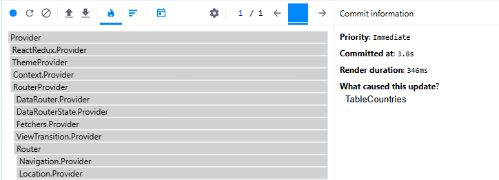
- Ranked Chart: Sorted list of components by render duration.
  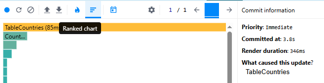

### Searching a country

- Commit Duration: 3s
- Render Duration: 76ms.
- Interactions: User interactions that triggered the renders.
- Flame Graph:
  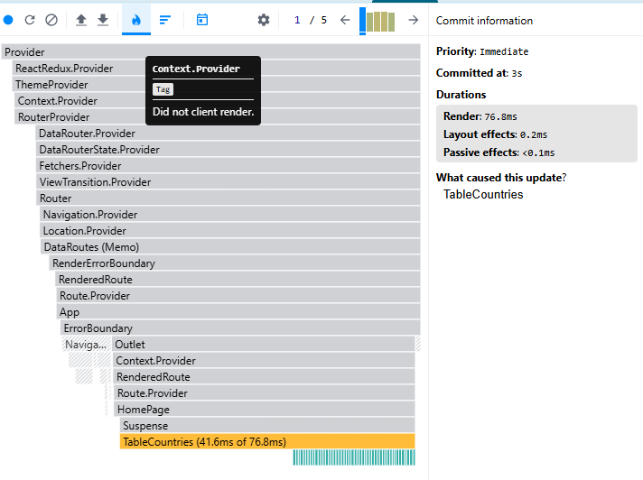
- Ranked Chart: Sorted list of components by render duration.
  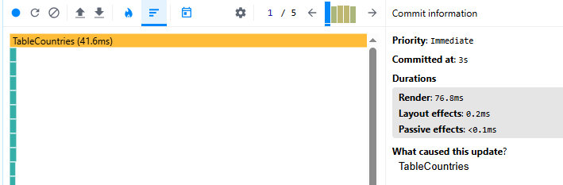

### Selecting another year

- Commit Duration: 3.8s
- Render Duration: 347ms.
- Interactions: User interactions that triggered the renders.
- Flame Graph:
  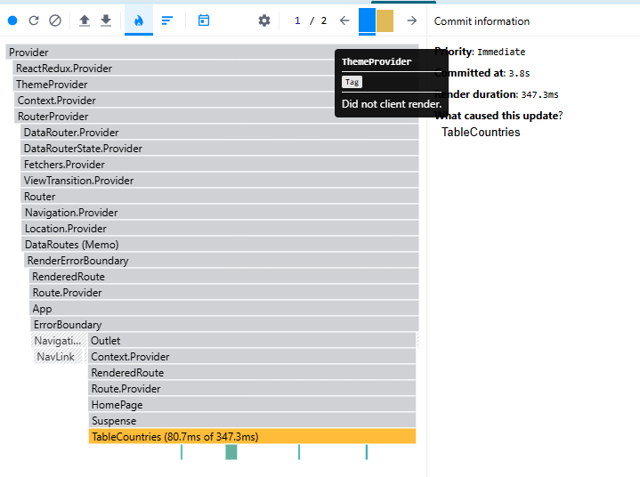
- Ranked Chart: Sorted list of components by render duration.
  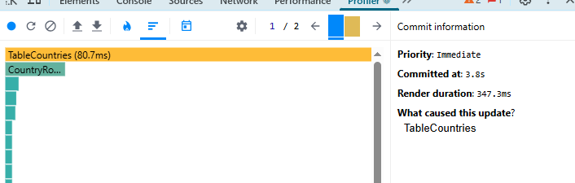

### Adding/removing columns

- Commit Duration: 1.4s
- Render Duration: 354ms.
- Interactions: User interactions that triggered the renders.
- Flame Graph:
  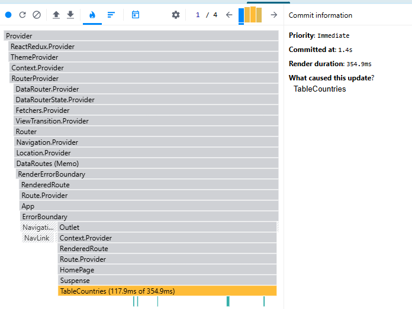
- Ranked Chart: Sorted list of components by render duration.
  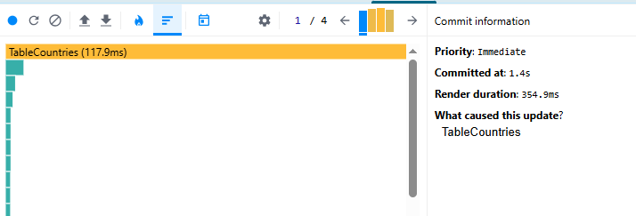

## After optimization

### Sorting a column

- Commit Duration: 2.2s
- Render Duration: 364ms.
- Flame Graph:
  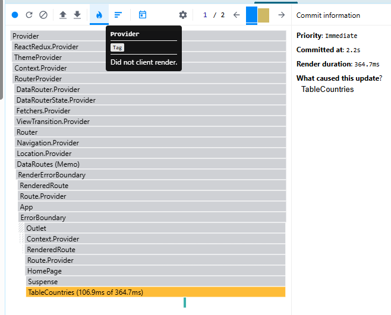
- Ranked Chart: Sorted list of components by render duration.
  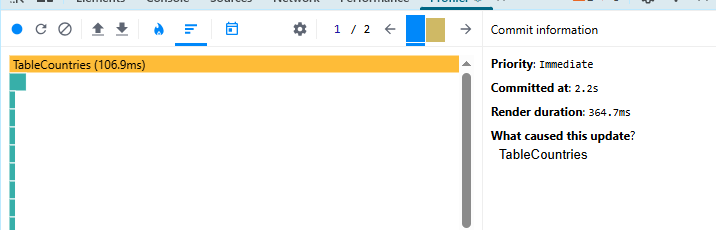

### Searching a country

- Commit Duration: 2.3s
- Render Duration: 265ms.
- Flame Graph:
  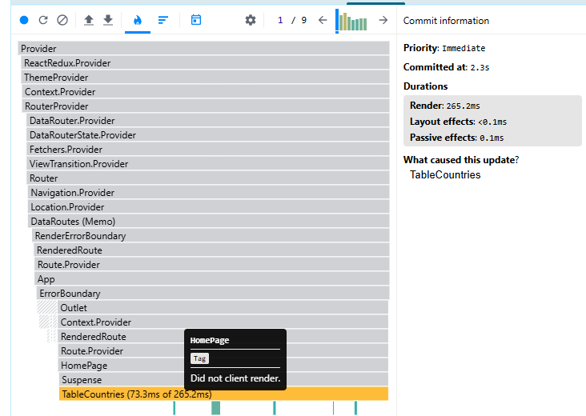
- Ranked Chart: Sorted list of components by render duration.
  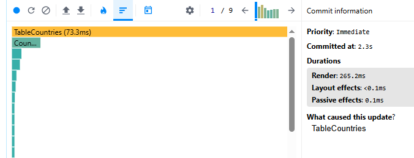

### Selecting another year

- Commit Duration: 3.8s
- Render Duration: 347ms.
- Flame Graph:
  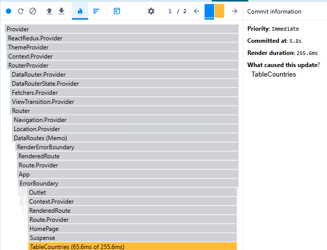
- Ranked Chart: Sorted list of components by render duration.
  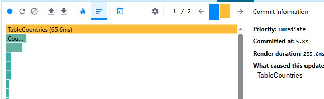

### Adding/removing columns

- Commit Duration: 1.4s
- Render Duration: 382ms.
- Flame Graph:
  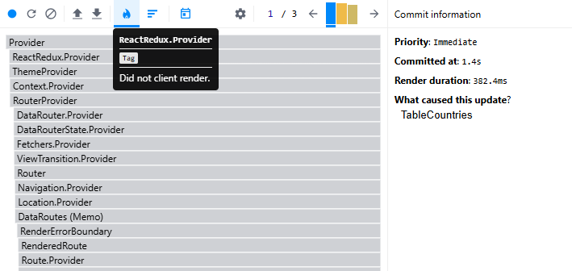
- Ranked Chart: Sorted list of components by render duration.
  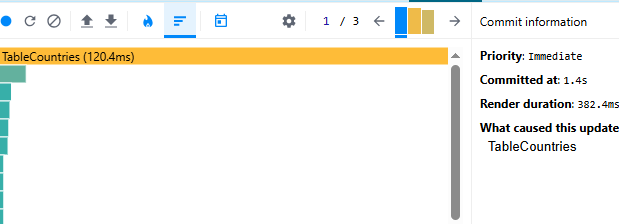
